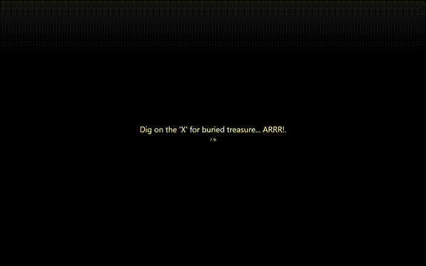

# magicgrove
Magicgrove allows you to play the trading card game: `Magic: The Gathering` 
against your computer.

## Demo

## How to play
The most entertaining game feature is limited tournaments.

* You can play a draft against up to 10 computer opponents.
* You can play a sealed tournament against up to 500 computer opponents.

If you don't have the time to finish the game, you can save it at any time, 
by simply pressing `Alt-Q` and choosing `Save game` menu option.

Currently (version 4) there are 1118 cards implemented. The following sets can 
be played in limited tournaments: 
* Magic 2015 Core Set,
* Urza's Saga,
* Urza's Legacy,
* Urza's Destiny.

Tapping lands is not needed in most of the cases – just click the spell and the 
mana will be payed automatically. If you want, you can also tap the lands 
manually. The mana will then be put into the manapool.

Priority is by default automatically passed for each step, except for
First main (active turn), Second main (active turn) and Declare blockers 
(active & passive turns).

You can change the defaults by clicking on the corresponding step's button.
A button has 4 states:

 * Transparent - priority is automatically passed on active & passive turns.
 * Green       - priority is automatically passed on passive turns.
 * Yellow      - priority is automatically passed on active turn.
 * Red         - priority is never automatically passed..

When an opponent plays a spell, auto priority passing is disabled.

### Shortcuts

 * `Spacebar`  - moves to the next step (passes priority).
 * `Enter`     - confirms attackers or blockers selection.
 * `Alt+q`     - shows Game menu screen and allows you to save your current game.
 * `F11`       - toggles between window and full screen mode.

### Requirements

To play the game you will need a Windows machine with .Net Framework 4.7.2 
installed.

### Deck editor

To modify existing decks or add new ones, you can use deck editor. Card library 
can be filtered by mana color or by searching for specific text written on the 
cards.

The default option for searching is by card names. To search other parts of the 
card, first specify property name and after the colon the desired feature 
(e.g. text:flying). Searching the following card properties is supported:

 * `name`
 * `text`
 * `flavor`
 * `type`
 * `power`
 * `toughness`

Conditions can be joined by using `AND` or `OR` (note the upper case).
Queries use [lucene query syntax](https://lucene.apache.org/core/2_9_4/queryparsersyntax.html).

#### Example

`text:flying AND power:5`

Only cards that have flying in the text and have power of 5 will be displayed.

## Custom themes

Only basic UI is included with the source code(while card images are not). 
Game visuals can be tweaked by modifying the contents of the media folder. 
If there is a .zip file in the media folder with the same name as a sub-folder, 
it takes precedence. E.g. images.zip takes precedence over /images folder.

If you wish, you can add your own cropped card pictures to the `/media/cards` 
folder or to the cards.zip file. Ugrove.exe utility can be used to find the 
right pictures and to crop them. The game uses old mtg frame format. Picture 
size has to be 410x326 pixels, and their names must match corresponding card 
names. Basic lands can have multiple versions, e.g. 
`forest1.jpg, ..., forest15.jpg`.

If you wish, you can add your custom avatars to the `media/avatars` folder.

Additional battlefield backgrounds can be added to `/media/images` folder.

The filename must start with the word 'battlefield', e.g. 
`battlefield-1.jpg, battlefield-2.png`... At the start of the game a random 
battlefield background is chosen.

Other images can also be replaced as long as they are the same size as the 
originals.

## For developers

### How to build

To build the game you will need 
[Visual Studio 2019 Community](https://visualstudio.microsoft.com/vs/community/).

### How AI is implemented

`Magic: The Gathering` is a game with hidden state. With every move computer 
simulates future moves and builds the game tree. During simulation hidden 
information is not available (computer is not cheating). Every leaf node is 
scored and the best move is chosen according to the min/max rule. The unpruned 
game tree would take too long to evaluate, thus heuristics are used to decide 
whether to expand the branch or not. AI uses special rules for:

 * target selection,
 * choosing the timing of spells and abilities,
 * X cost calculation,
 * combat simulation,
 * mana payments,
 * repeated activations of abilities,
 * special card decisions.

I also contributed to StackExchange explaining the basic algorithm used in [magicgrove](
https://gamedev.stackexchange.com/questions/33972/how-would-one-approach-developing-an-ai-for-a-trading-card-game/82557#82557).

### Deck generation
Limited decks are automatically generated from given starter and booster packs.
Computer first creates multiple decks for various color combinations, and then 
chooses the one which wins a simulated tournament. 
For sealed tournaments pre-generated decks are saved and reused.

## Project History

### Version 1 (2011 - 2012) - 73 cards
I started developing magicgrove in 2011. I chose c# because that was the 
programming language I was most used working with. I chose WPF for UI because I 
had some prior experience with it and because I didn't want the game to look 
like a windows forms app.

My goal for the project was to create a fully functional MTG game to be played 
against a computer. I implemented just enough cards to create 1 playable deck.

I started with game logic and UI. When I later wanted to add AI, I realized 
this could not be done with my initial design. I started doing some research. 
I found much help and inspiration in one other similar open source project 
written in Java - [magarena](https://magarena.github.io/).

I redesigned the game logic and in May 2012 I finally shipped version 1, 
featuring 73 cards and 6 decks. There was only random game mode available - 
each player got a random deck and would then play best of 2 matches.

### Version 2 (2012 - 2013) - 550 cards
After version 1, I decided it would be cool to implement limited tournaments, 
where computer would not only play the game, but would also build the deck to 
be used during the game. To realize this idea, I had to implement one whole set 
of cards. I decided the first set to be implemented would be Urza's Saga set. 
I also added some other features like deck editor and support for saving the 
game. The save game feature was especially useful for debugging. When the game 
crashed, I generated a save game file, which allowed me to later replay the 
game with debugger attached.

There were multiple releases between version 1 and version 2:

* version 1.0 (May 23, 2012) - 73 cards
* version 1.1 (Jun 8, 2012) - 73 cards
* version 1.2 (Jun 16, 2012) - 83 cards
* version 1.3 (Jun 23, 2012)- 108 cards
* version 1.4 (Jul 14, 2012) - 131 cards
* version 1.5 (Jul 23, 2012) - 157 cards
* version 1.6 (Avg 17, 2012) - 190 cards
* version 1.7 (Oct 27, 2012) - 230 cards
* version 1.8 (Mar 26, 2013) - 307 cards
* version 1.9 (Jun 27, 2013) - 408 cards
* version 2.0 (Oct 3, 2013) - 550 cards

Version 1.9 had sealed tournament game mode added, and version 2 had draft 
tournament game mode added. Limited tournaments are one of the most engaging 
features of the game.

### Version 3 (2013 - 2014) - 690 cards

With version 3 (Jul 14, 2014), I added one more set: Urza's Destiny. That meant 
that the Urza's block was concluded, bringing the total card count to 690. 
I also improved AI and UI. The project was migrated to github 
(from [googlecode](https://code.google.com/archive/p/magicgrove/)).

### Version 4 (2014 - 2015, 2020) - 1118 cards

After the version 3, I decided to take a break. The game had all the features 
I wanted, and was fun and engaging to play.

In September 2014 I was contacted by sandmann. He liked the game and told me 
he would like to implement a newer edition. The game lacked a core set, so we 
decided we would add the newest one - M15 set. Sandmann would do most of the 
work required to implement the cards while I would review them and help him 
with any engine modifications.

We almost did it back in 2015. In July 2015 80% of the work was done; almost 
all the cards were implemented and there were only 100 left for me to review 
but “life happened” and I needed to take a break from this hobby project.

In January 2020 I decided to finish what we started almost 6 years ago. 
I migrated the project to the latest Visual Studio and reviewed the remaining 
100 cards. I also improved the deck building and drafting algorithms, and added 
some UI features for which we had agreed back in 2015 that would be great.

In June 2020 version 4 was released, featuring Magic 2015 Core Set and 1114 cards.

## License

The project source code is licensed under GPL-3 License.

## Developers

pinky39 and sandmann123

## Credits

`Magic: The Gathering` was created by Richard Garfield. It is published and 
developed by Wizards of the Coast.

This project uses the following open source libraries:

* log4net
* caliburn.micro
* castle.windsor
* xunit
* psake
* [lucene.net](http://lucenenet.apache.org/)

The quote 'Is it a mistake to think you can solve any major problems just with 
potatoes?' is by Douglas Adams.

Some graphics are taken from [openclipart.org](https://openclipart.org/).
Some loading messages are taken from 
[here](http://www.stackprinter.com/export?service=stackoverflow&question=182112).